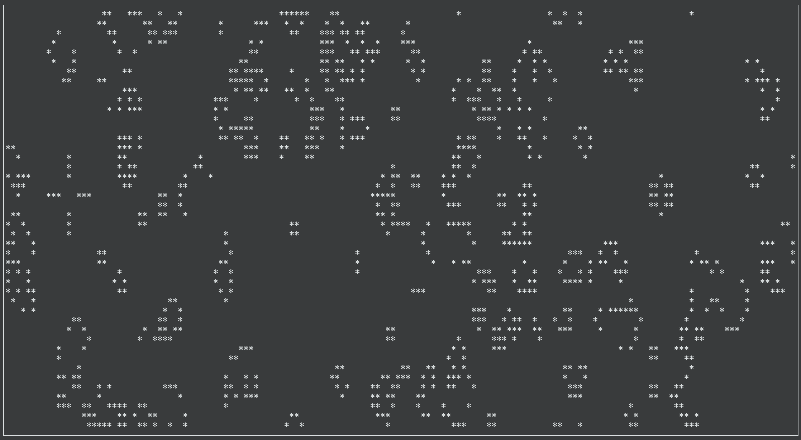

# rust-life
Conway's Game of Life, in Rust.



This is a Rust implementation of my [Go implementation](https://github.com/joeygibson/life)
of [Conway's Game of Life](http://en.wikipedia.org/wiki/Conway%27s_game_of_life). It runs
in a terminal window, using `ncurses` for drawing.

This may not be the greatest implementation, but it works. I will try to fully
Rust-ify it in the future. 

## Building
Running `cargo build` will generate `target/debug/rust-life`.

## Running
You can just run it by running `cargo run`

The full set of options are these

```bash
Usage: rust-life [options]

Options:
    -c, --columns columns
                        number of columns of board (default: full screen)
    -r, --rows rows     number of rows of board (default: full screen)
    -i, --iterations iterations
                        # of iterations
    -H, --hacker        seed with the hacker emblem
    -w, --wait iterations
                        milliseconds to sleep between iterations (default:
                        500)
    -f, --foreground black, red, green, yellow, blue, magenta, cyan, white [default]
                        foregound color
    -b, --background black [default], red, green, yellow, blue, magenta, cyan, white,
                        background color
    -h, --help          display this help message
```
Once running, press any key to exit.

